# Trabalho Final - DEVOPs CICD (Turma 37CLD)

Este repositório contém a entrega do trabalho final da disciplina de DevOps CI/CD. O projeto consiste em uma aplicação web moderna integrada a um pipeline completo Desenvolvimento, Segurança e Operações.

 1. Copiar o Repositório (Fork)
Clique no botão **"Fork"** no canto superior direito desta página para criar uma cópia deste repositório na sua conta do GitHub.

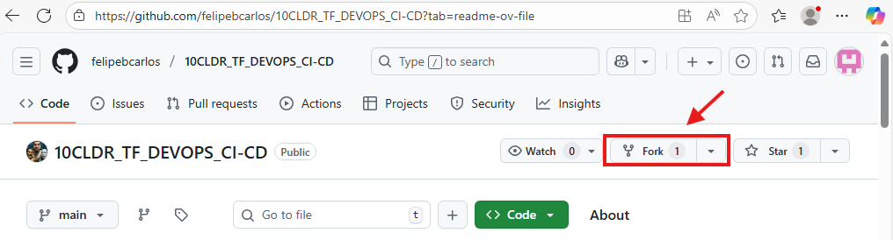

1. Verifique se o nome do repostório está disponível e altere caso deseje um nome mais curto ou amigável.
2. Deixe marcada a opção **"Copy the main branch only"**.
3. Clique em **"Create fork"**.

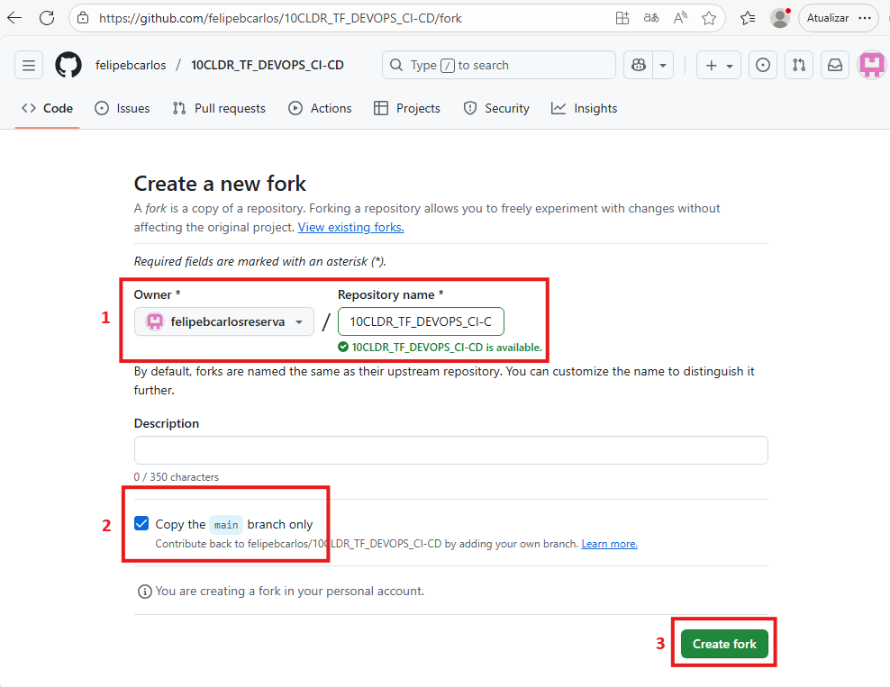

 2. Configurar o Repositório
No seu novo repositório copiado:
1. Vá em **Settings** > **Actions** > **General**.

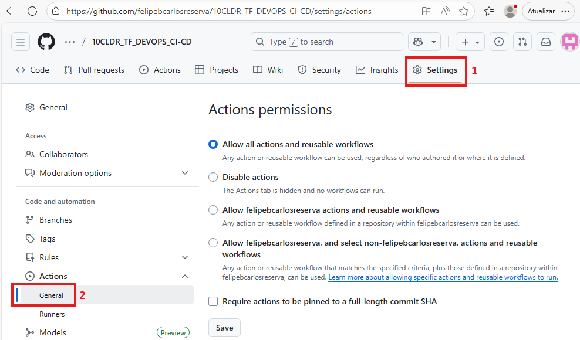

2. Role a página até encontrar a sessão **"Workflow permissions"**, e garanta que a opção **Read and write permissions** esteja selecionada e clique em **"Save"**.

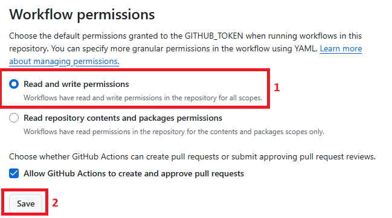

 3. Habilitar o Pipeline
Por segurança, o GitHub desativa Actions em forks.
1. Vá na aba **Actions**.
2. Clique no botão verde **"I understand my workflows, go ahead and enable them"**.

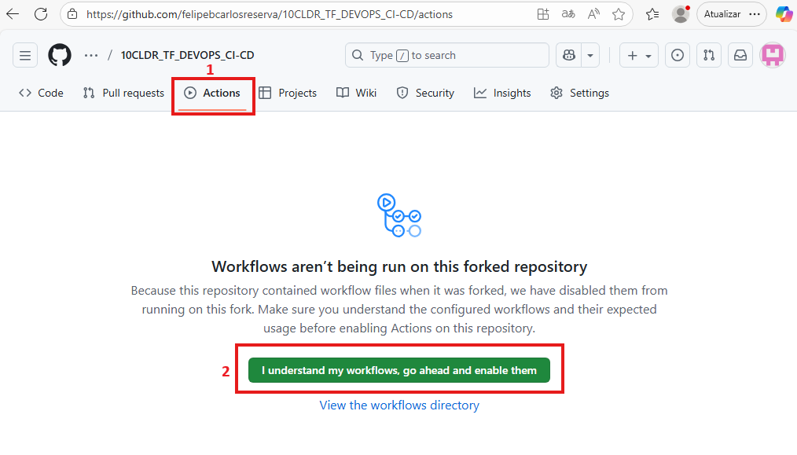

 4. Rodar o Deploy
Faça qualquer alteração no código (ex: edite o `README.md` ou o `App.jsx`) e faça um `git push`. O pipeline rodará automaticamente e publicará seu site!

1. Clique em **"Code"** e depois no arquivo **"README.md"**.

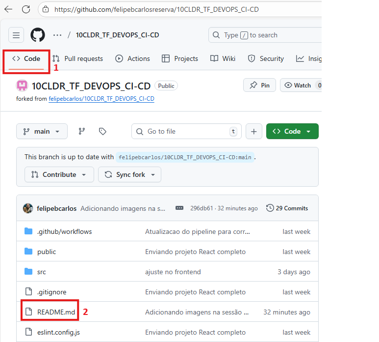

2. Clique no botão de edição de arquivos.

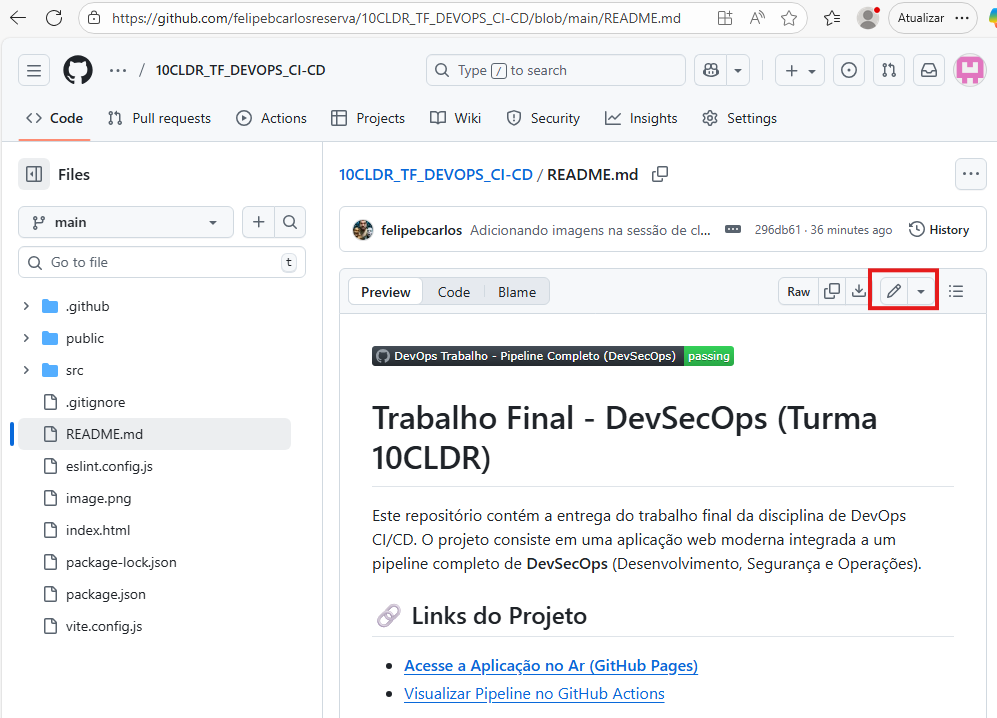

3. Faça qualquer alteração no arquivo e então clique em **"Commit changes"**.

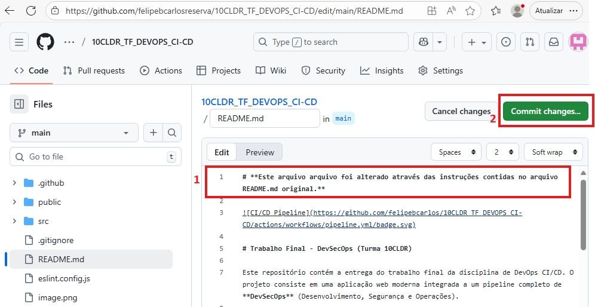

4. Adicione um comentário e clique em **"Commit changes"** novamente.

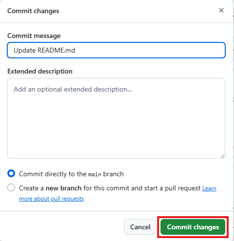

5. Vá até **"Actions"** para acompanhar a execução.

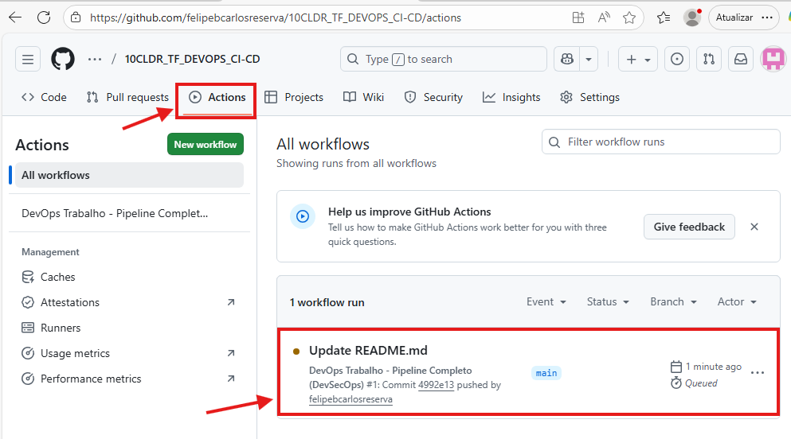

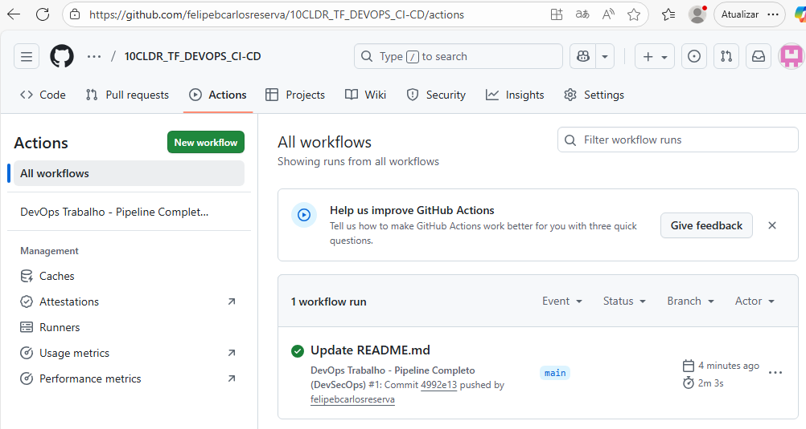

6. Após a finalização, volte ao menu **"Code"**, role a página e veja a alteração feita.

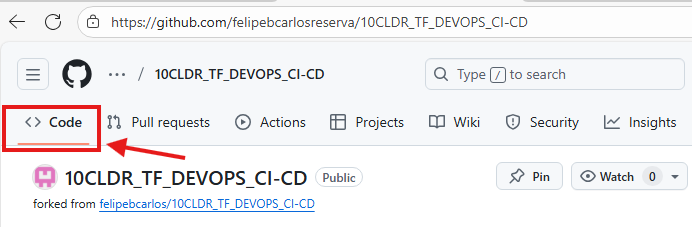

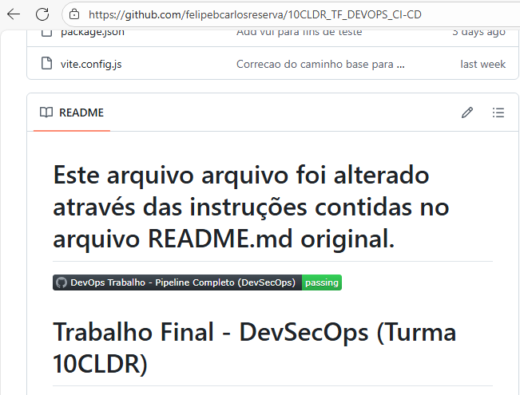

---

O projeto utiliza as seguintes tecnologias e ferramentas:

### Frontend
* **[React](https://react.dev/)**: Biblioteca JavaScript para construção de interfaces.
* **[Vite](https://vitejs.dev/)**: Ferramenta de build extremamente rápida.
* **[Node.js](https://nodejs.org/)**: Ambiente de execução JavaScript.

### CI/CD & Infraestrutura
* **[GitHub Actions](https://github.com/features/actions)**: Orquestrador de workflows de CI/CD.
* **[GitHub Pages](https://pages.github.com/)**: Hospedagem estática gratuita e automatizada.

### Qualidade de Código (QA)
* **[ESLint](https://eslint.org/)**: Ferramenta de Linter para análise estática e padronização de código.
* **Integration Tests**: Scripts automatizados para validação de integração.

### Segurança (Sec)
* **[Trivy](https://aquasecurity.github.io/trivy/)** (SAST): Scanner de segurança para encontrar vulnerabilidades no código fonte e segredos expostos.
* **[NPM Audit](https://docs.npmjs.com/cli/v8/commands/npm-audit)** (SCA): Análise de vulnerabilidades nas dependências do projeto.
* **[OWASP ZAP](https://www.zaproxy.org/)** (DAST): Scanner de segurança dinâmica que ataca a aplicação em execução para encontrar falhas de segurança web.

---

Arquitetura do Pipeline

O pipeline foi desenhado seguindo as melhores práticas de mercado, dividindo o fluxo em **6 Jobs** distintos:

Qualidade
Executa a verificação de sintaxe (`Lint`) e testes de integração. Garante que o código está limpo antes de prosseguir.

Segurança Estática
Roda em paralelo com a Qualidade.
* Executa o **NPM Audit** para checar bibliotecas inseguras.
* Executa o **Trivy** para varrer o código em busca de senhas expostas (Secrets) e falhas de segurança.

 Build
Compila a aplicação React para produção. Este passo só inicia se os jobs de *Qualidade* e *SAST* forem aprovados. O artefato gerado é salvo para uso posterior.

 Deploy
Baixa o artefato construído e realiza a publicação automática no ambiente de produção (**GitHub Pages**).

Smoke Test 
Após o deploy, executa validações rápidas (`curl`) para garantir que o site está respondendo corretamente (HTTP 200 OK) e está acessível publicamente.

Segurança Dinâmica 
Com o site no ar, o **OWASP ZAP** realiza um scan automatizado na URL pública em busca de vulnerabilidades de tempo de execução (como falta de cabeçalhos de segurança, XSS, etc).

---
